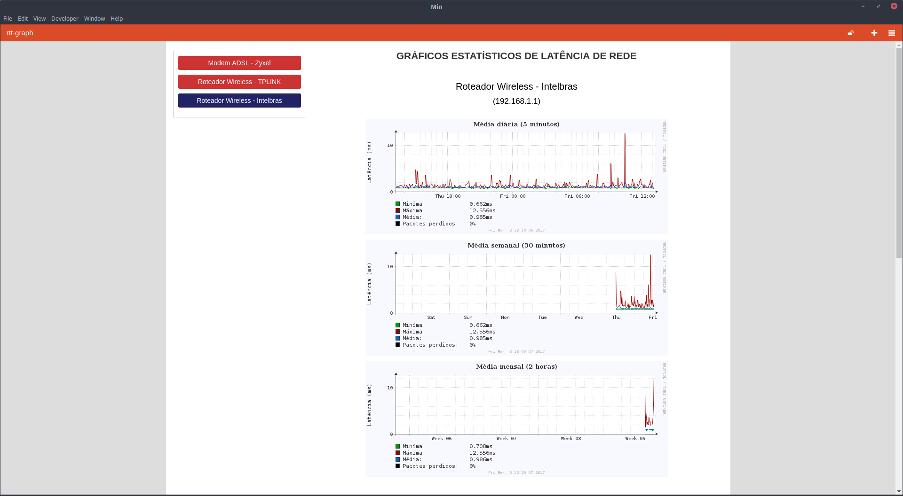

# rtt-graph.sh
Shell script que utilizando o RRDTool e o comando ping gera gráficos estatísticos diários, semanais e mensais relativos a latência de rede, tudo muito simples e bem funcional. Para mais detalhes sobre configuração e uso, leia a documentação que acompanha o projeto.

